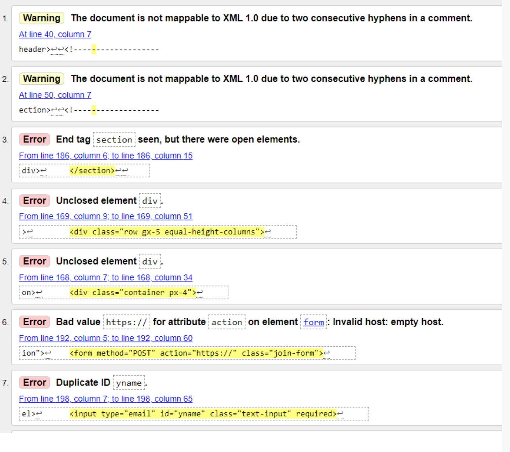

# Rock Bristol School of Yoga

# A responsive website of a Yoga Studio to show what they offer to the students, share their approach and increase the number of students subcriptions, and visitors 

## Code Institute - Milestone Project 1 

### HTML/CSS Essentials - Users Sentric, Static Front-End Website

### By Manuel Perez

[View Repository in GitHub Pages] (https://github.com/Manuperezro/MSP1-Code-Institute-Yoga-School)

[view Website Link ] (https://manuperezro.github.io/MSP1-Code-Institute-Yoga-School/)
## The Why

Made the studio more accesible to students giving them the possibility to see the live classes timetable, and get to know what the studio offers.

Share the approach of the yoga studio, and information about prices, workshops and yoga related articles.
 
## The Bussines Goal

+ Increase the number of new students 
+ Increase sales on Introductory offers

## (UX) User Experience: 

Users will be able to find relevant information in the webside to email the studio to book classes online, see any changes in the timetable, get to know the approach of the teachers and read descriptions of the differences clases taught in the studio to be able to decide wich class is best for them.

User will acces to contact information and they will be able to see the location of the studio.

- ### User Stories

  - #### First time Users Goals:
     - To be captivated by the content.
     - To get to know bout Introductory offer.
     - To Understand the approach and the different yoga  classes in the studio.
     - To know the location of the studio.
  - #### Returning Users Goals:
     - To remember how to find relevant information 
     (Remember how to navigate).
     - Find the best and easy way to contact the studio.
     - Find relevant links.
  - #### Frequent Users Goals:
     - To see if there is any new offer.
     - Find updates in the timetable.
     - Find new workshops.
     - Find when there is a cover teacher running a class.

## Design:

The Desing of the website is made to ivite visitors to come to get to know the studio, the studio yoga approach and yoga styles, and to book classes and offers.
So I tried to do a simple web with lights colors, wich is easy to navigate through and pleasent at the same time, also Include some "motivational" pictures of practicioners doing some fancy yoga poses to show what they will be capable to learm if they decided to learm and practice yoga in the studio.

### Design Brief:

+ Color:

The main colors used in the web are: 

- light grey: considered the color of architecture, commerce and theory. Some psycologies studies agree the gray bring; neutrality, wisdom, intelligence, futuristic, resignation, stable, dignity, and compromise.

- Orange :  Orange is often described as an energetic color. It may call to mind feelings of enthusiasm and excitement. Because orange is a high-energy color, many sports teams use orange in their uniforms, mascots, and branding.

Also Orange is an attention getting color, highly stimulating and friendly. 

Characteristic that suit perfectly with the need and goals of the website.

The color orange is often associated with spiritual practices including meditation and compassion.

- White :  White represents purity or innocence. 

White is bright and can create a sense of space or add highlights. Designers often use the color white to make rooms seem larger and more spacious, and I tried to transmit the  inner space that

yoga can bring to the students using the color on the website, and the breathing space. 

- Links : The color of the Links to navigate in the ahimsa.html are blue with the porupose to made easy to users to identify that they are external links.

+ Typography:

- Ubuntu = H2 and H3 and H4

- Lato = Paragraphs

+ Images:

- Background Image/ Hero Image/ home page: I used a yoga bright picture of yoga studion class with the teacher of some students practicing yoga and smailing to each other. to invite New      students to try the experience, and transmit the space of peace that the studio can be.  

- Sections images: In the other sections I used images of yoga practicioners doing some fancy posses to try to create some motivation in  users, to invited them to start or keep oracticing yoga.

- Ahimsa image: I choose a picture where a practicioner is in a meditation pose, to transmit the spiritual part of yoga.

## Wireframes:

The Basic structure of Rock Bristol Yoga School was skectched using [balsamiq](https://balsamiq.com/).

Here some images of the procces( to see full wireframe click PDF) : 

-  PC Mac screen: 

- Tablet screen: 

- Mobile screen: 

- PDF:  
  [Wireframe PDF](https://drive.google.com/file/d/1Ma2lZGsFX_GElv23_iktQVi_kj2reLCx/view?usp=sharing)

## Features

 - #### Existing Features:
     
   + Navigation bar there are links to the “Home”, “classes” "workshops" and  “Ahimsa” page.

   + Buttons to redirect to a future app to be able to book and made online payments.

   + iframe to show the location in google maps

   + Form : Icluded in the footer section, the users can always see the oppornutity to register.

   #### (future features)

    "buttons to link with and app to to do online payments and online booking" (mindbody app)

## Technologies: 

### Languages used: 

- [HTML](https://en.wikipedia.org/wiki/HTML5)

- [CSS](https://en.wikipedia.org/wiki/CSS)

### Also I used: 

- [Bootstrap](https://en.wikipedia.org/wiki/Bootstrap_(front-end_framework))

- [Google Fonts](https://en.wikipedia.org/wiki/Google_Fonts)

- [Font awesome](https://fontawesome.com/v4.7/icons/)

- [Balsamiq](https://balsamiq.com/)

- [Pexels](https://www.pexels.com/)

## Testing: 

### Testing results:

- [W3C Markup Validation Service](https://validator.w3.org/)

 + To validate HTML and CSS code.

 
 Index.html :

-  Errors: 

 Ahimsa.html :

-  Errors: 

Validators Results :

Index.html 

classes.html 

Workshops.html 

Ahimsa.html 

style.css 

### Lighthouse results:

Index.html : 

Classes.html : 

Ahimsa.html : 

Workshop.html : 

### Testing User Stories from User Experience (UX) Section

 #### First Time Visitor Goals: 

  ######  As a First Time Visitor, I want to easily se hat the studio offers, find when the classes take place (timetable) also the prices and offers:
     
     - Upon entering the site, users will see the first a hero image
     so the users can get an idea on how the studio looks like.

     - Just ath the botton it is a call to action offer showing the new members offer. 
     and a button wich open a modal to Sign Up, 
     so users can easyly click and sign to the offer.
     (with futures features they will be able to made payments)

     - After this the Users can find 2 bigs pisctures with links, 
     that ghuide then to the sction of classes and prices, and workshops, 
     so they can find what the studio offer as a daily basics.

     - Follwing the links there is an introduction of the teachers that works in the studio, 
     so users know what to expect in the classes before the procced to booking.

  #####  As a First Time Visitor, I want to be able to easily be able to navigate throughout the site to find content and find where the studio is located:

    - At the top of each page the is a header with the logo and the navigation menu, 
    wich mades easy to navigates throw the four pages of the site. 

    - At the botton of the header in the Index page, there is a call to action 
    for first time visitors( new members offer ) 
    and at the botton of this 2  call to action redirections links,
     so the users always now where to go and they don't feel trapped 
     as they reach the botton of the page.

    - At the bottom of the footer in all pages there is a link to bring back 
    the users to the top of the page, to the nav menu, 
    so is easy to the user to move to what is looking for.

    -In the Home page the users can fin a call of action link wich get to the iframe map location
     at the botton of the page and also to the contact us information.

  ##### As a first time visitor I want to see some stories and reviews from other ussers to get to know the studio. I also Want to find the links to the social media to find more information about the studion and ussers thoughts and reviews and be able to determine how trasted and known the studio is:

    - After the teaching section the users can read some reviews from others visitors.

    - at the botton of the Visit us here the user can find links to social media, 
    link to the studio gmail and the iframe google map location at the right side. 
    
 #### Returning Visitor Goals: 

  ##### As a returning Visitor, I want to book easyly classes and workshops:
   
    - The links for classes/ Prices and workshops are right on the middle in the home page.  
      This pages two will be the most visited pages for a returning visitor

    - In the classes and workshops pages are buttons with open a modal to be able to register to a future app (mindbody-online-app), 
    in wich the users will be able to made online bookings and payments.

  ##### As a returning Visitor, I want to fin any new updates in the timetable and workshops section:

    - In the footer at every page the users can find a form to join and reveive direct email with every update.

    - Also Updates in the timetale will be highlated in the timetable.

  ##### As a Returning Visitor, I want to find the best way to get in contact with the organisation with any questions I may have:

    - At the botton in index.html is section with "find Us": and "Contac us:" where users can find the contact information.

    - In the same section users can find social media links.

 #### Frequent Users Goals:

##### As a Frequent User, I want to be able to book a class easyly:

    - The user would already be comfortable with the website layout and can easily click the classes link to book in the timetable with a few clicks.

##### As a Frequent User, I want to check to see if there are any new workshops.

    - The user would already be comfortable with the website layout and can easily click the workshop page.

#####  As a Frequent User, I want to sign up to the Newsletter so that I am emailed any major updates and/or changes to the class timetablewebsite workshops or events.

    - At the bottom of every page their is a footer which content is consistent throughout all pages.
      in the center of the footer there is a form where the user can "Subscribe to our Newsletter" 
      and are prompted to Enter their email address.
      There is a "Join !" button just underneath of the input field which is located close to the field and can easily be distinguished.

## Deployment:

### Inception:

 + this project was created using Code Institute template from GitHub:

 + After the creation of the project, I rename it as : MSP1-Code-Institute-Yoga-School.

 + In order to push this project from GitPod to Github i used a set of git commands on the terminal: 
  
  - git status  - Check the status of the repository and see if there were any changes in files 

- git add .  - Add the files that were modified/created, so we can commit it 

- git commit -m "message for commit"  - Commits all the changes

- git push  - Pushes all committed versions to GitHub.

#### Deployment to GitHub Pages:

+ The project was deployed to GitHub Pages using the following steps:

- Log in to GitHub and locate GitHub Repository

- At the top of repository click on "Settings"

- Once you are in settings scroll down to "GitHub Pages"

- Under "Source", click the dropdown called "None" and select "Master Branch".

- After the page automatically refresh scroll down again on "GitHub Pages" and I will  see live link to the published site.

### Cloning repository:

+ Local Clone

- Log in to GitHub and locate GitHub Repository

- At the top of repository click on Code

- From the dropdown menu under HTTPS copy the link

- Now on your IDE create a directory where you wanna make the clone

- Type git clone and paste the link that you copy from step 3.

### Forking repository:

By forking the GitHub Repository we make a copy of the original repository on our GitHub account to view and/or make changes without affecting the original repository by using the following steps:

- Log in to GitHub and locate the GitHub Repository
- At the top of the Repository (not top of page) just above the "Settings" Button on - - the menu, locate the "Fork" Button.
- You should now have a copy of the original repository in your GitHub account.

## Credits:

## Aknowledgements:

A huge thankyou to my mentor who has been incredibly helpful and approachable throughout this project.

Likewise, to the tutors for helping through to completion on this.

And for the main teacher at the City of Bristol College.

Big Thanks.

 

